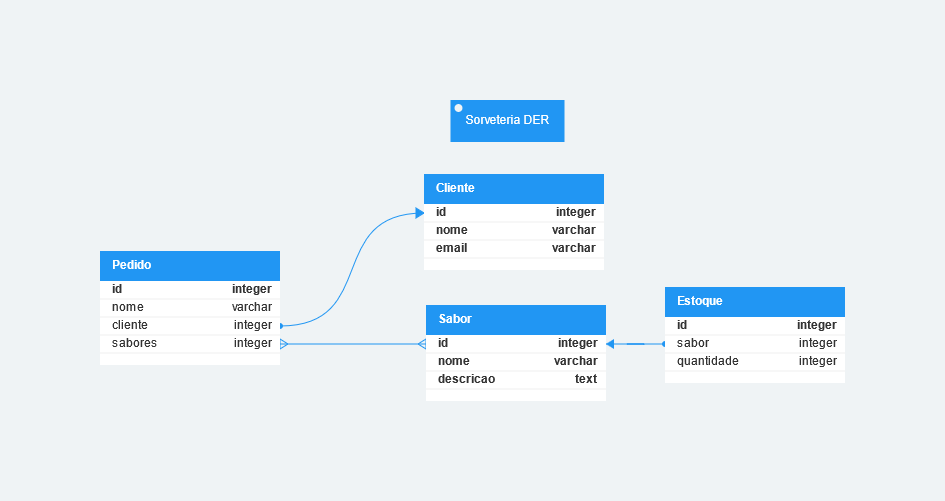

# trabalho-ricart

## Diagrama de entidade e relacionamento



## Configurando ambiente virtual

```bash
py -m venv .venv
.venv/Scripts/activate
pip install -r requirements.txt
```

## Iniciando o servidor python

```bash
py manage.py runserver
```